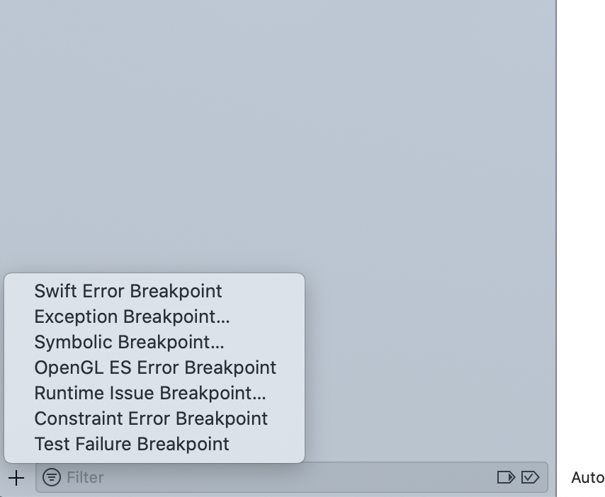

## View Debugger

- Focus on troublesome views 
- Visualize your constraints

View Debugger helps you visualize the hierarchy of views in current view. It's a great way to view the relationship between views(sibling and parent/child), also it's a great place to see the auto layout constraints between these views.

## Advanced Breakpoint Actions

- Catch exceptions at throw, print message 
- Print expressions without adding clutter

Under Breakpoint Navigator, user could manually add variety breakpoints, shows in the following image:

In the demo, click 'Exception Breakpoint' to add a general exception breakpoint, but this would not show any exception error information. 

To display further information about exception error, one trick to do is in the console at the breakpoint, `po $arg1` could print out the latest exception error message in the console, which means we could add this as an action for corresponding breakpoint.

## Address Sanitizer (ASan)

Enable this tool in `Edit Scheme...` under `Diagnostic`

The benefit of using ASan to Analyze Memory Corruption
- Use after free
- Heap buffer overflow
- Stack buffer overflow
- Global variable overflow Overflows in C++ containers 
- Use after return

It's better to use it under none `[-O0]` optimization configuration.